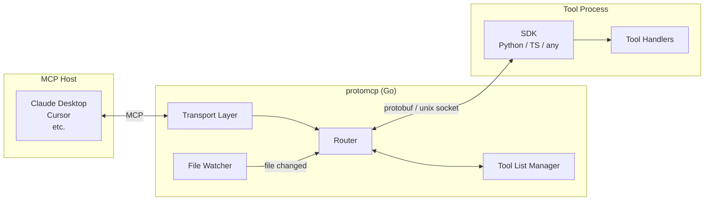
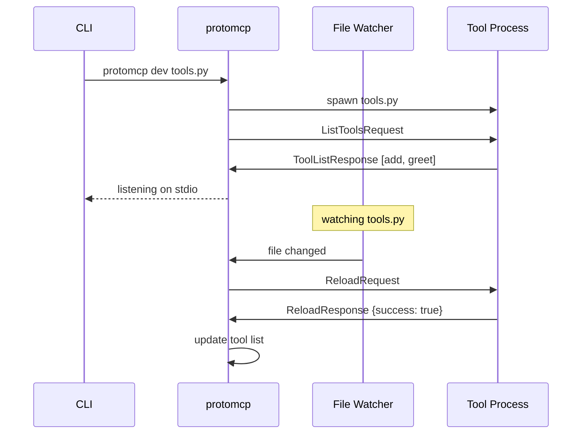
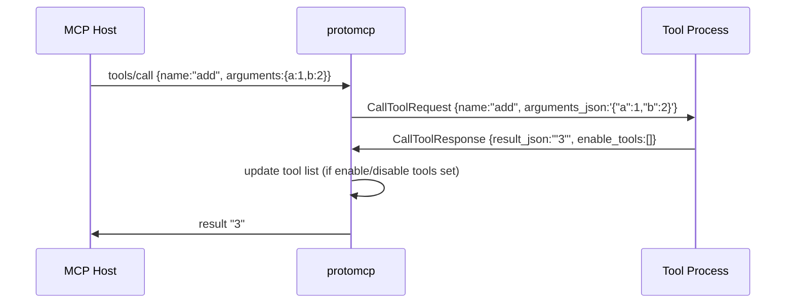
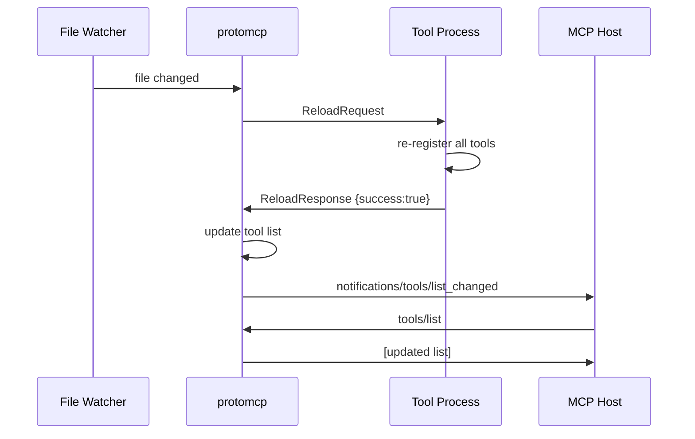

## Overview

protomcp is a Go binary that acts as a protocol bridge. On one side it speaks the Model Context Protocol (MCP) to an AI host. On the other it speaks a simple protobuf protocol over a unix socket to your tool process.



---

## Components

### Transport Layer

Handles the MCP host connection. protomcp supports five transports, selected with `--transport`:

- **stdio**: Reads MCP from stdin, writes to stdout. The host spawns protomcp as a child process.
- **SSE**: HTTP server with Server-Sent Events. One persistent connection per client.
- **Streamable HTTP**: HTTP with chunked responses. Supports multiple concurrent connections.
- **WebSocket**: Full-duplex WebSocket connection.
- **In-process**: For testing — no network I/O.

The transport is transparent to the tool process. Your tools work the same regardless of which transport the host uses.

### Router

Receives MCP requests from the transport and dispatches them to the tool process. Key behaviors:

- **tools/list**: Returns the current active tool list from the Tool List Manager.
- **tools/call**: Forwards the call to the tool process, waits for `CallToolResponse`, then updates the tool list if the response includes `enable_tools`/`disable_tools`.
- **Reload**: On file change signal from the File Watcher, sends `ReloadRequest` to the tool process, waits for `ReloadResponse`, then sends `notifications/tools/list_changed` to the host.

### Tool List Manager

Maintains the set of active tools and enforces the current mode (open, allowlist, or blocklist). See [Tool List Modes](/concepts/tool-list-modes/).

### File Watcher

Monitors the tool file for changes (dev mode only). Uses OS-level file notifications. When a change is detected, signals the Router to trigger a reload.

---

## Process lifecycle



---

## Unix socket protocol

The unix socket is created by protomcp at startup. The tool process connects to it (the SDK handles this automatically). All messages use the length-prefixed protobuf framing:

```
┌─────────────────────────────────────────────────────┐
│ 4 bytes (uint32, big-endian): message length N      │
├─────────────────────────────────────────────────────┤
│ N bytes: serialized protobuf Envelope               │
└─────────────────────────────────────────────────────┘
```

The `Envelope` uses a `oneof msg` field to carry all message types. See the [Protobuf Spec](/reference/protobuf-spec/).

---

## Tool call flow



---

## Reload flow



In-flight calls are not interrupted. If a call is in progress when a reload is triggered, the reload is queued and applied after the call completes.

---

## Statelessness

protomcp is stateless with respect to your tool logic. It only tracks:

- The current tool list (active set + mode)
- In-flight request correlation IDs

If protomcp is restarted, it reconnects to the tool process (or restarts it) and re-fetches the tool list. The tool list state is rebuilt from the tool process's `ToolListResponse`.
