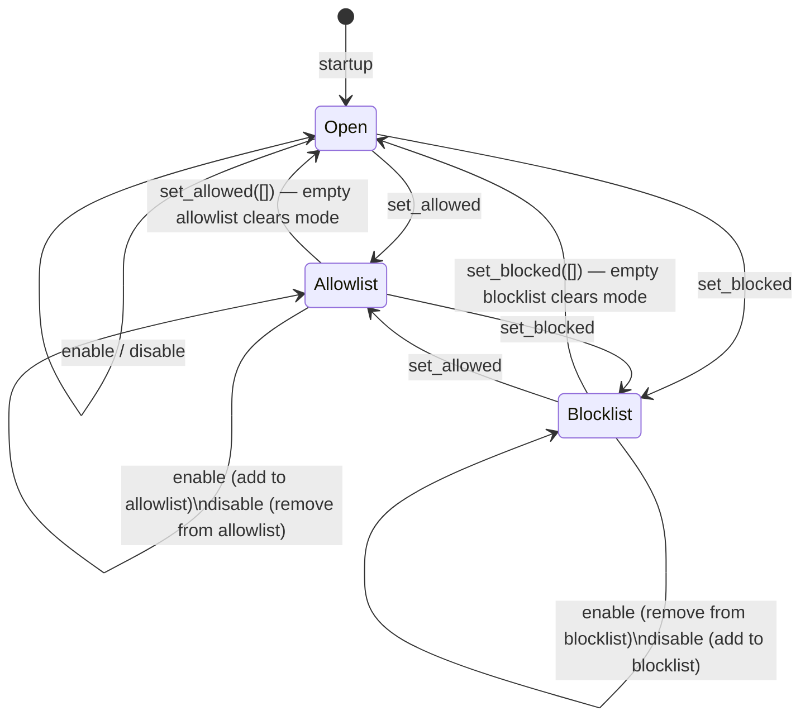

## Overview

The Tool List Manager in protomcp tracks which tools are currently visible to the MCP host. It operates in one of three modes:

| Mode | What's visible |
|------|---------------|
| **Open** | All registered tools, minus any explicitly disabled |
| **Allowlist** | Only the tools in the allowlist |
| **Blocklist** | All registered tools, minus the tools in the blocklist |

---

## Open mode (default)

At startup, the tool list is in open mode. All tools returned in the `ToolListResponse` are active.

Enable/disable operations in open mode track deltas:

- `enable(["a", "b"])` — adds `a` and `b` to the active set (removes from disabled set)
- `disable(["c"])` — removes `c` from the active set (adds to disabled set)

```python
# Open mode: all tools active
# Disable specific tools
tool_manager.disable(["dangerous_delete"])
# Re-enable later
tool_manager.enable(["dangerous_delete"])
```

---

## Allowlist mode

Call `set_allowed` to switch to allowlist mode. Only the tools you specify are active. All others are hidden.

```python
# Switch to allowlist: only these two tools are visible
tool_manager.set_allowed(["read_file", "search"])
```

Use allowlist mode when you want to start with a minimal surface area and explicitly opt in to each tool.

To add tools to an existing allowlist, call `enable`:

```python
tool_manager.enable(["write_file"])  # adds write_file to the allowlist
```

To remove tools from the allowlist, call `disable`:

```python
tool_manager.disable(["read_file"])  # removes read_file from allowlist
```

---

## Blocklist mode

Call `set_blocked` to switch to blocklist mode. All registered tools are active except those you specify.

```python
# Switch to blocklist: everything except these is visible
tool_manager.set_blocked(["nuclear_launch", "format_disk"])
```

Use blocklist mode when you have many tools and want to hide a few dangerous or irrelevant ones.

To add more tools to the blocklist, call `disable`:

```python
tool_manager.disable(["another_dangerous_tool"])
```

To remove tools from the blocklist, call `enable`:

```python
tool_manager.enable(["nuclear_launch"])  # removes from blocklist (becomes visible again)
```

---

## State diagram



---

## Batch operations

The `batch` method lets you perform multiple operations in one round-trip. All operations are applied in order:

1. `enable` — enable tools
2. `disable` — disable tools
3. `allow` — switch to allowlist with these tools
4. `block` — switch to blocklist with these tools

```python
# Enable some, disable others, atomically
tool_manager.batch(
    enable=["write_file"],
    disable=["read_only_hint"],
)

# Switch to allowlist with a single call
tool_manager.batch(allow=["read_file", "search"])
```

---

## Effect on MCP host

Whenever the active tool list changes (from enable/disable/set_allowed/set_blocked), protomcp sends `notifications/tools/list_changed` to the MCP host. The host then re-fetches the tool list with `tools/list`, and the updated set of tools becomes available in the conversation.

This is how tools can "appear" or "disappear" mid-conversation based on context.
