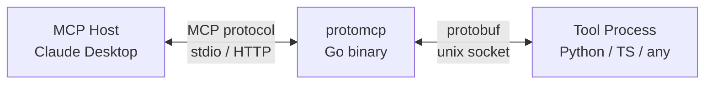
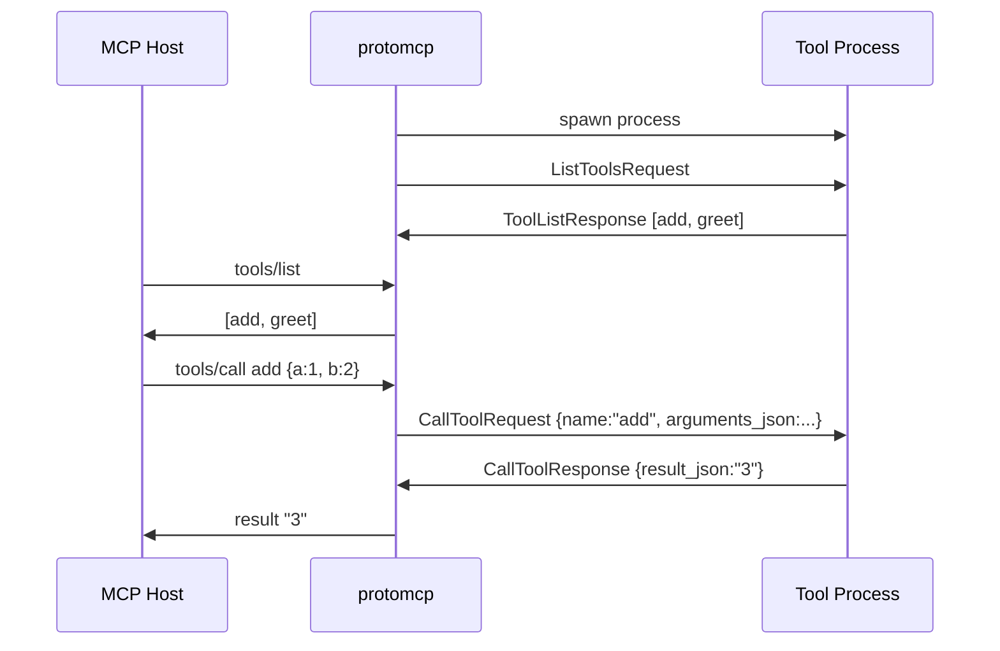
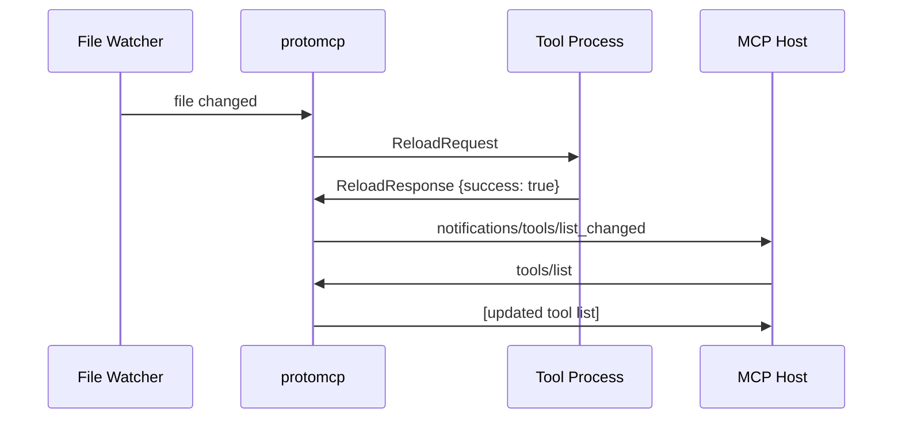
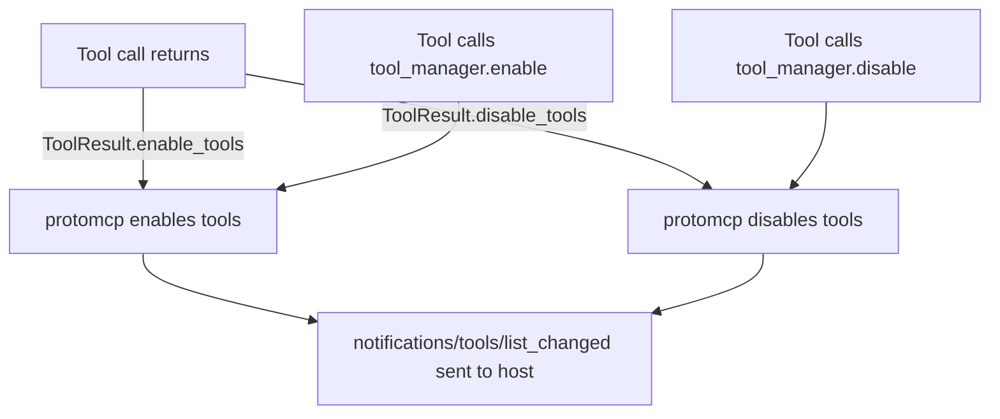

## Three Layers

protomcp connects an MCP host to a tool process through three distinct layers:



**Layer 1 — MCP Host**: Your AI client (Claude Desktop, Cursor, etc.). Speaks the Model Context Protocol. protomcp is fully transparent to it.

**Layer 2 — protomcp (Go binary)**: Bridges MCP and your tool process. Handles hot reload, tool list management, transport negotiation, and request routing. Stateless — restartable at any time.

**Layer 3 — Tool Process**: Your code. Registers tool handlers using the SDK. Communicates with protomcp over a unix socket using a simple length-prefixed protobuf protocol.

---

## Startup Sequence



---

## Hot Reload

When you save your tool file, protomcp detects the change (via file watch) and:

1. Sends a `ReloadRequest` to the tool process
2. Tool process re-registers all tools and responds with `ReloadResponse`
3. protomcp sends `notifications/tools/list_changed` to the MCP host
4. Host re-fetches the tool list

In-flight calls complete before reload takes effect. With `--hot-reload immediate`, the process is restarted instead of asked to reload — useful for languages without dynamic reload support.



---

## Dynamic Tool Lists

Tool processes can change their own tool list at runtime, without a file change. This lets tools enable or disable each other based on context:



Tools can also use `tool_manager` (Python) or `toolManager` (TypeScript) to modify the tool list mid-call, or set an explicit allowlist/blocklist.

---

## Wire Protocol

All communication between protomcp and the tool process uses a simple framing:

```
[4 bytes: uint32 big-endian length][N bytes: serialized protobuf Envelope]
```

The `Envelope` message wraps all request and response types in a `oneof` field. See the [Protobuf Spec](/protomcp/reference/protobuf-spec/) for full details.

---

## Transports

protomcp supports two transports for the MCP host side:

| Transport | Flag | Use case |
|-----------|------|----------|
| stdio | `--transport stdio` | MCP clients that spawn subprocesses (default) |
| Streamable HTTP | `--transport sse` (also accepts `http`) | Remote or web-based MCP clients |

See [Transports](/protomcp/concepts/transports/) for details.
